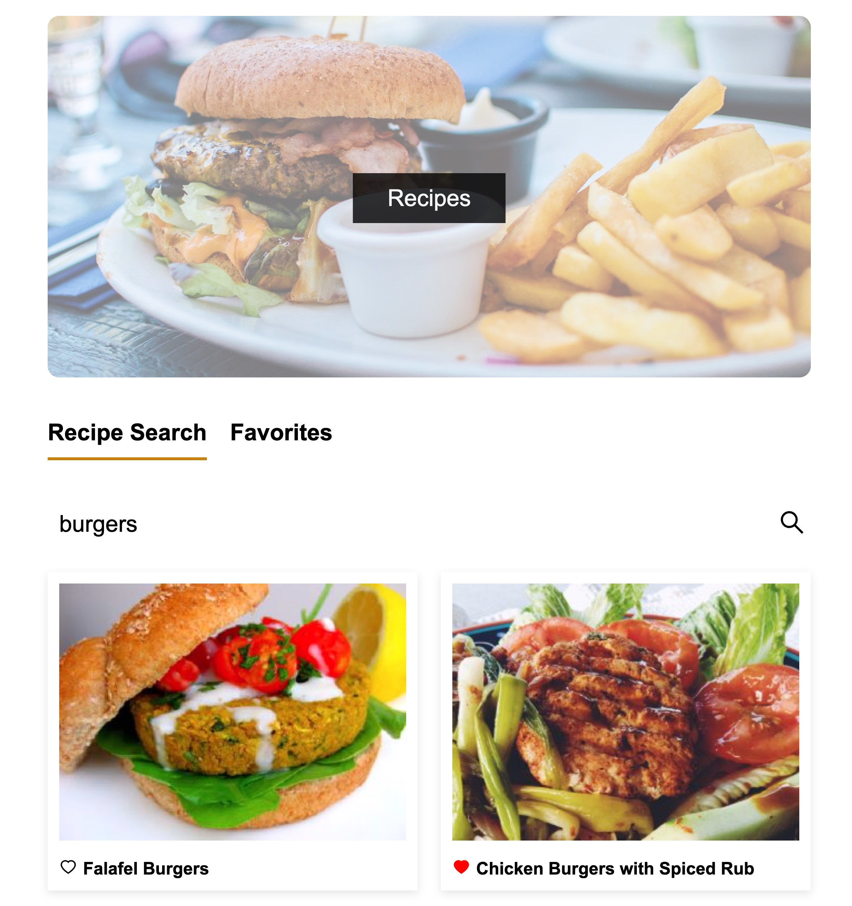
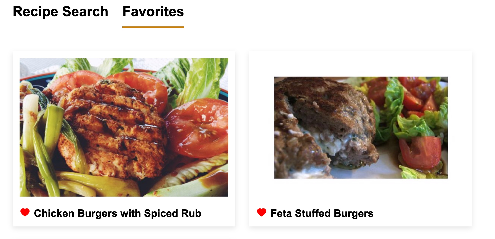

## Recipes

### This personal projects aimed to practice a bit of TS and connecting PostgreSQL via Neon to Front-End, hence making a full-stack portfolio project.

### Features
- Search for recipes (API spoonacular)
- Mark/Remove favorite recipes and save them to the DB
- Pagination (via view more)

### Installation
```bash
cd backend
npm i
.env variables required for DB and API key (spoonacular)
npx nodemon
```

```bash
cd frontend
npm i
npm run dev
```

### Example pictures


